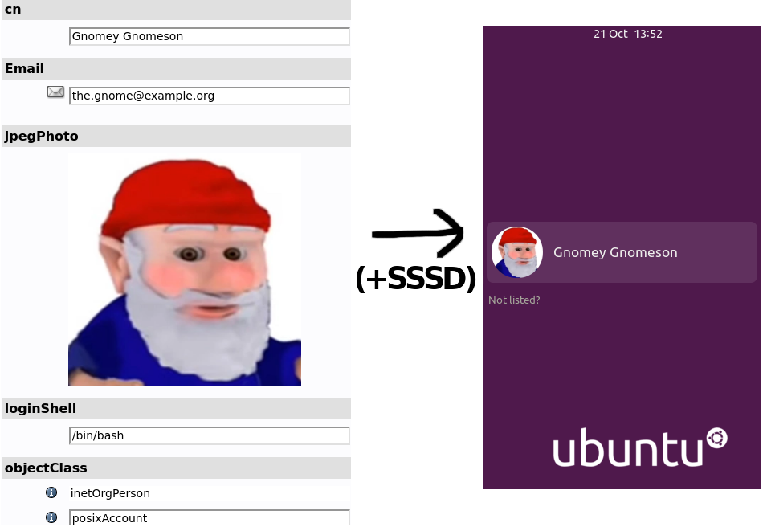

# LDB FUSE

> Everything is a file. Even files!

Provides a read-only FUSE view onto contents of an SSSD-cache-style LDB database:

* User profile photo and thumbnail
* Sudoers entries

Can also automatically set freedesktop user profile pictures thus available via DBus.

## How to install for SSSD

1. Install requirements: `apt install python3-ldb python3-fusepy python3-pydbus python3-apscheduler`
2. Instruct SSSD to cache user photos: in `/etc/sssd/sssd.conf`, add `ldap_user_extra_attrs = jpegPhoto` under your LDAP domain heading
3. Install application: `cp ldb-fuse.py /usr/local/sbin/ldb-fuse`
4. Install systemd service:
    1. Edit arguments in `sss-fuse.service` to point to the LDB file where SSSD caches your domain info (usually `/var/lib/sss/db/cache_YOURDOMAIN.ldb`)
    2. `cp sss-fuse.service /etc/systemd/system/`
    3. `systemctl enable sss-fuse; systemctl start sss-fuse`
